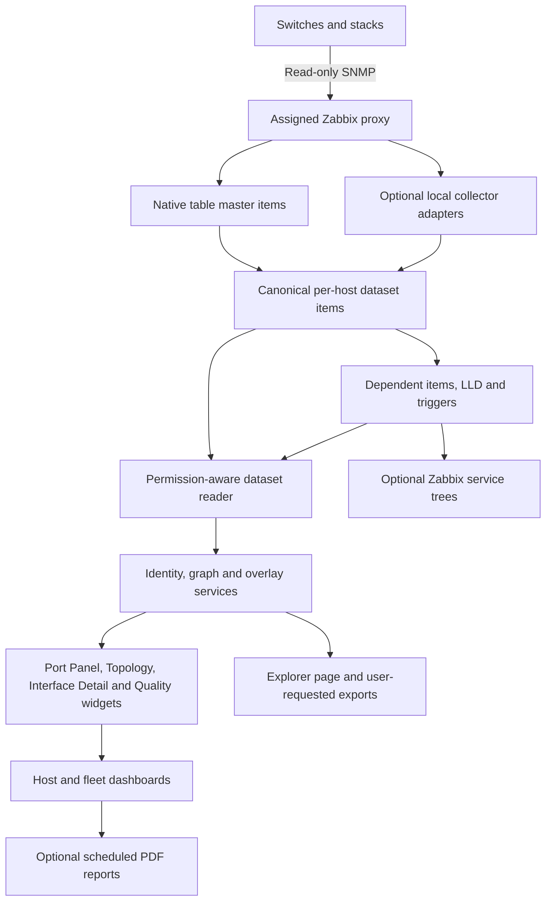

# Zabbix Network Explorer: architecture and product design

## 1. Outcome and boundaries

Provide a network investigation workspace inside Zabbix: start from a switch or network scope, inspect physical ports, follow LLDP peers, understand VLAN/STP/LAG relationships, and see which observations are stale, incomplete or unsupported.

Zabbix remains the monitoring source of truth. A frontend package reads permission-filtered per-host datasets. Native SNMP table collection is preferred. A proxy-local adapter is an optional acquisition path for joins, contexts or vendor behaviours that native collection cannot handle efficiently. No separate authoritative network inventory or topology database is introduced.

The proposed first usable milestone is interfaces, speed policy and LLDP peer navigation. The next milestone adds fleet topology and LAG. VLAN and STP follow as explicit release gates. All requirements in the supplied specification remain in the full programme; optional enrichment is separately identified.

User-selected compatibility range: Zabbix 7.0 through 7.4. Test pinned patches from 7.0, 7.2 and 7.4; use a shared baseline with small compatibility adapters for verified differences. Exact patch releases and deployment platforms remain inputs. Research has inspected official 7.0 and 7.4 source; intermediate 7.2 compatibility remains a runtime test requirement, not an established result.

## 2. Logical architecture



The graph is derived at read time, with short-lived caches only. Each host owns its dataset. A central host containing the entire network would undermine ordinary host permissions and is prohibited as the default storage design.

Four deployment units:

1. Template bundle: capability templates, canonical item contracts, LLD, derived metrics, triggers and inherited dashboards.
2. Frontend package: one base module with Explorer routes, plus separately registered widget modules. Shared library/assets are shipped with the package using supported module loading and explicit package-local paths. Each widget has its own manifest; do not assume one manifest registers several widget types.
3. Optional collector package: independently versioned proxy-local executable and vendor adapters. No frontend-to-collector command channel.
4. Provisioning tools: install/import verification, site dashboard generation, fixture tooling and optional service-tree proposals.

## 3. Canonical contracts

Use JSON Schema with explicit `schema_version`. Every dataset is independently versioned and collected: device, interfaces, LLDP, VLAN, STP, LAG; later PoE and optics. Separate fast interface state from slow interface inventory to avoid sending a full configuration tree every minute.

Dataset envelope:

```json
{
  "schema_version": "1.0",
  "dataset": "lldp",
  "generation_id": "opaque-collection-id",
  "attempted_at": "2026-10-06T12:00:00Z",
  "observed_at": "2026-10-06T12:00:00Z",
  "status": "ok",
  "complete": true,
  "source": {"method": "native_snmp", "adapter": "standard-lldp", "version": "1.0"},
  "capability": {"state": "supported", "reason": null},
  "errors": [],
  "data": []
}
```

This illustrative envelope excludes host IDs because proxy collection need not know the server-assigned host ID. The reader associates items with their owning Zabbix host. Timestamps originate from the collection path, with clock-skew checks; receiving delayed proxy data must not make old observations fresh.

Collection outcome: `ok`, `partial`, `failed`, `unsupported`. Display freshness: `current`, `stale`, `unknown`; collection failure and capability state are additional independent dimensions. A failed attempt must never advance the observation time of retained data. Last successful data may remain visible with an explicit failed/stale badge.

In the native path, derive attempt/unsupported evidence from item status/error and heartbeat history; preprocessing cannot run on a poll that produced no value. In the fallback path, the collector emits an envelope even for handled failures. Do not fabricate failure records from missing values. Store last-success snapshots separately from attempt records when necessary. Empty complete data and absent/failed data are different states.

Identifiers and relationships:

| Entity | Contract |
|---|---|
| Device | Zabbix host ID at read time; chassis identities including subtype, vendor/model/firmware, serial evidence, stack members, management address candidates with provenance; no credentials |
| Interface | Device-local opaque UID, current ifIndex, original name/alias, type, physical/logical classification, member/slot/port, speed in bit/s, duplex, MTU, MAC, admin/oper states, discontinuity and change evidence |
| LLDP observation | Local port identifier/subtype, mapped interface UID when known, remote chassis/port identifier and subtype, raw and normalised values, remote name/address candidates, capabilities, observation time, source |
| Physical edge | Canonical endpoint pair when resolvable, individual observations, confirmation/confidence, freshness, possible LAG parent; preserve unresolved endpoint observations |
| VLAN membership | Device-local VLAN ID/name, interface UID or bridge-port reference, configured/current membership, tagged/untagged/unknown, PVID, native evidence, forbidden evidence, VLAN/bridge domain |
| STP | Protocol/instance, region/bridge-domain context, VLAN-to-instance mapping, interface role and state as separate enums, root/designated bridge identifiers, cost/priority, topology-change evidence |
| LAG | Device-local logical interface UID, local aggregator ID, members, member operational/selected/distributing states where exposed, protocol/mode, actor/partner evidence, inferred peer(s) |
| Quality | Capability, source, collection outcome, observation age, resolution confidence and reasons, missing fields, truncation and clock-skew warnings |

Names, VLAN IDs, aggregator numbers and STP instance numbers are not globally unique. Device and bridge-domain context must accompany them. Handle multiple management addresses, IPv4 and IPv6; distinguish configured SNMP endpoint, advertised LLDP management address and device addresses. Do not choose one silently.

Interface UID policy: prefer hardware member/slot/port identity when reliable; otherwise use a namespaced normalised interface name with documented adapter rules. ifIndex is a current locator. MAC and alias are supporting evidence, not guaranteed unique or stable keys. When identity becomes ambiguous, allocate a new generation/identity and show uncertainty rather than merging histories. LLD item keys use opaque escaped-safe UID tokens; names remain display metadata. Cross-renumbering mapping needs captured evidence and dedicated tests.

## 4. Zabbix storage and retrieval

Proposed key namespace:

```text
ne.device.snapshot
ne.interfaces.inventory
ne.interfaces.state
ne.lldp.snapshot
ne.vlan.snapshot
ne.stp.snapshot
ne.lag.snapshot
ne.capabilities
ne.collection.status[dataset]
ne.collection.success[dataset]
ne.if.oper[uid]
ne.if.admin[uid]
ne.if.speed[uid]
ne.if.duplex[uid]
ne.if.expected.speed[uid]
ne.if.degraded[uid]
```

Dataset items are text, with trends disabled. Native raw walk master items feed canonical JSON dependent items through tested preprocessing; scalar prototypes and LLD derive from canonical items. Avoid duplicating the full dataset into every per-port item. Reuse existing traffic/error items where their contracts are confirmed.

The reader first obtains permitted hosts and tagged item metadata, then retrieves latest values using supported frontend/API mechanisms for the pinned version. Do not assume `item.get` alone returns usable latest text values. `history.get` with a global `limit=1` returns one row total, not one per item. Prototype batching via the supported frontend history manager where it preserves authorisation, or bounded per-item history calls with measured costs. Authorise item IDs before reading; avoid direct SQL, superuser credentials and permission bypass flags.

A latest failed envelope must not overwrite the only copy of successful data. Use separate derived success snapshots or a bounded history lookup according to the chosen acquisition path. `observed_at` remains inside the retained snapshot. Account for discard-unchanged preprocessing: an unchanged value still needs a documented heartbeat and freshness semantics.

Provisional retention: raw walks 1 day or less; canonical success snapshots 7 days; collection diagnostics 7 days; scalar monitoring history 30 days and trends 365 days subject to existing housekeeping. Retention is tunable and must be sized. Seven days of snapshots is not a promise of synchronised topology history.

Never rely on compression to bypass item-value limits. In the acquisition spike, measure limits for text values, SNMP results, preprocessing, sender/external output and frontend responses on the target build. Partition by dataset and, when needed, stable member/VLAN-range shards. A small manifest lists shard count, generation and completeness; publish/read only complete matching generations. Include manifests and shards in authorisation filtering.

Sizing example: 300 devices, 100 KiB configuration snapshots every 5 minutes yields about 8.2 GiB/day of raw values before database/index overhead. Separate change-driven inventory/configuration snapshots from small periodic freshness heartbeats. Never declare success by dropping unchanged data while losing evidence of a successful new collection.

## 5. SNMP acquisition and vendor capability model

Use numeric OIDs at runtime, and source/MIB references in documentation. Standard identity and interfaces are shared; vendor/model/firmware adapters express only differences. Capability starts unknown and is promoted to supported/partial/unsupported after evidence. Timeout/authentication failure is not evidence that an OID is unsupported.

| Dataset | Candidate sources | Required joins/cautions |
|---|---|---|
| Device | SNMPv2-MIB, ENTITY-MIB, vendor inventory | sysObjectID dispatch; distinguish chassis, members and replaceable modules |
| Interfaces | IF-MIB including ifXTable, EtherLike-MIB | ifHighSpeed in Mbit/s to bit/s; ifSpeed saturation; counter discontinuity; physical classification |
| LLDP | LLDP-MIB and applicable extensions | TimeMark/local-port/remote-index compound keys; local-port-to-ifIndex mapping; binary/text IDs and subtypes; multiple neighbours |
| VLAN | Q-BRIDGE-MIB, BRIDGE-MIB, vendor MIBs | dot1dBasePortIfIndex; MSB-first port bitmaps; current/static distinctions; PVID/native semantics; SNMP context |
| STP | BRIDGE-MIB, applicable RSTP/MSTP/vendor MIBs | Role/state split; VLAN/instance/region mapping; PVST contexts; missing mapping prevents a confident VLAN-forwarding claim |
| LAG | IEEE8023-LAG-MIB, ifStackTable, vendor MIBs | Local aggregator IDs differ between peers; multi-chassis aggregation may span two peers |
| PoE/optics | POWER-ETHERNET-MIB, ENTITY-SENSOR-MIB and vendor sources | Enrichment, model-specific units and physical sensor association |

Avoid broad unsupported subtree walks on every cycle. Probe capabilities on enrolment/firmware change and use bounded rechecks. Bulk request sizes, timeout/retry and maximum walk duration are per-model tuning controls. A multi-subtree walk is not an atomic snapshot: record collection windows and reboot/discontinuity evidence, reject or mark mixed generations.

Provisional polling defaults: interface operational/speed/duplex 60 s; counters 60 s when enabled; interface inventory 1 h; LLDP 5 min; VLAN 10 min; STP 60–120 s; LAG 5 min; identity/capability 24 h. STP polling cannot capture every transient convergence event. Collectors use jitter and bounded per-proxy concurrency; native items use supported scheduling. Stagger LLDP/VLAN walks and measure proxy preprocessing queues before increasing scope.

A falling-back collector defaults to Python 3 with schema validation and pinned dependencies. Shell is limited to a launcher; it must not parse complex SNMP data or build executable command strings from untrusted identifiers. Prefer an in-process SNMP library with tested v2c/v3 and authPriv algorithms on the selected platform.

Two fallback modes:

- Short collection: a Zabbix external-check wrapper under configured `ExternalScripts` accepts an approved device identifier and dataset. It uses a local allowlisted configuration and returns a bounded envelope. Read the outcome field; official 7.0 source disables process exit-code validation for external checks.
- Longer/context-heavy collection: a proxy-local scheduled worker stages complete snapshots and publishes to Zabbix through a verified ingestion path, or exposes a local result reader used by external checks. Sender destination, TLS and proxy support must be tested on the exact release; do not silently send to another site or server. Status heartbeat and success data remain separate.

Fallback credential provisioning is an explicit installation requirement: an external script does not automatically inherit Zabbix's SNMP interface credentials. Native acquisition reuses configured Zabbix SNMP interfaces. Fallback credentials require administrator-managed local protected bindings or a supported secret provider; never read proxy database credentials, pass communities/passwords as item-key arguments, or copy secret macros into frontend data. Collector config is non-executable, protected and outside the web root. No raw credentials in argv, stderr, fixtures or exceptions.

## 6. Discovery: three distinct workflows

### 6.1 Device inventory and enrolment

Start with already monitored hosts: inventory vendor/model/firmware, assigned proxy/site, existing templates, SNMP configuration metadata and discovered interface item contracts. Inventory export does not print credential values. Do not treat advertised LLDP names as proof of host identity.

Optional native Zabbix network discovery is scoped to administrator-supplied IP ranges on the site proxy. Use read-only identity checks and separate discovery actions for groups/tags/template linking. Credential provisioning must precede SNMP checks. Device auto-enrolment is disabled by default; produce a candidate list for controlled enrolment. No network sweep is authorised by the design alone.

Unresolved LLDP peers are graph observations, not monitored hosts. Device candidates retain first/last seen, originating observations, model evidence, proposed site/proxy and conflict reasons. Overlapping/private addresses require site or routing-domain context. A collector must not chase discovered addresses into unapproved networks.

### 6.2 Within-device LLD

Discover physical/logical interfaces and stack members. VLANs and STP instances have their own bounded LLD only where scalar monitoring or triggers justify it; avoid a device × interface × VLAN × instance item explosion. Keep bulk memberships in snapshots.

LLD uses canonical identity tokens and explicit filters for virtual/CPU/loopback interfaces. Retain logical LAG and VLAN interfaces for graph association without rendering them as copper ports. On a complete successful observation, reconcile additions/removals. On partial/failing walks, preserve the last successful discovery payload, and use bounded lost-resource grace periods; never feed an incomplete empty array into LLD.

Provisional policy: lost entities visible with stale state immediately; disable only after 24 h of confirmed absence on successful collections, delete after 7 days. Exact LLD lifetime controls are verified on the target version. Renumbering updates locators, while ambiguous changes create identities rather than silently rewriting history.

### 6.3 Across-device reconciliation

Resolve only among authorised hosts at read time. Matching precedence: exact normalised chassis identity; exact unique management address in site/routing domain; uniquely matched system identity with corroboration. Hostname alone is weak. Retain ambiguous candidates without selecting one. Resolution evidence and confidence are available in details.

Map remote interfaces using port ID subtype and vendor-provided equivalence rules, with description as supporting evidence. Unknown remote interface does not invalidate an observed local link. Reconcile A→B and B→A into one edge where compatible; retain disagreement, multiple peers and one-sided relationships. Do not infer a broadcast segment's complete physical structure from multiple LLDP peers.

The network-wide view is Monitoring → Network Explorer; global dashboards are optional custom compositions and are not required for ordinary use. Host dashboards remain the single-switch view.

Scope has two controls: authorised seed hosts/site/tag/CIDR, and bounded neighbour expansion. Site comes only from the administrator-controlled `site` host tag (never hostnames, addresses, proxies or LLDP names); a permitted neighbour at another site stays visible as context. Default one hop, configurable within limits. Management subnet compliance is an annotation rather than a visibility filter; connected out-of-subnet neighbours remain visible when permitted. Report unknown and multiple management addresses separately. Scope containment supports IPv4/IPv6.

## 7. Graph and overlay rules

Physical graph edges represent observed cabling/adjacency, with freshness and confidence. Parallel links remain individually inspectable. LAG is a grouping over member links, not a replacement for them. Preserve member failures and distinguish logical capacity from summed nominal member speeds. Multi-chassis LAG may connect an aggregate to several chassis; do not force a single remote node.

VLAN edge classification: both sides configured to carry the VLAN; one side missing membership; both sides missing; or unknown/incomplete. Native/untagged mismatch is its own anomaly. A configured membership path is different from a potential forwarding path, which also requires operational state, compatible STP instance information and LAG selected/distributing state when available.

VLAN analysis returns observed reachable subgraph and candidate boundaries, with reasons and uncertainty. VLAN translation, QinQ/tunnelling, virtual chassis and vendor bridge domains require explicit capability support; otherwise mark unsupported/unknown rather than drawing a false continuous VLAN path. No claim of packet delivery, MAC reachability or service availability follows from membership alone.

STP overlay displays root/designated/alternate/backup roles separately from discarding/blocking/learning/forwarding states according to the exposed protocol. Root path inference requires consistent instance/region and bridge evidence. Cycles in the physical graph are normal; they are not automatically a fault. Alert on evidence-backed inconsistencies, not on the presence of redundancy.

Expected-speed policy precedence: host context macro/policy by stable interface name; explicit model/role policy; reliably exposed configured target where it means intended speed; otherwise unknown. Capacity may be displayed separately. Do not use previous maximum negotiated speed as an implicit permanent target. Native macro resolution and policy provenance must agree between triggers and widgets.

Semantic state evaluation: administrative disable; unknown/stale evidence; operational down/error threshold; speed/duplex degradation; normal. Freshness is an independent badge so stale green is impossible. Speed warnings require interface up, valid actual/expected values and persistence. Half duplex can be observed; a true duplex mismatch needs evidence from both endpoints or explicit expected-duplex policy. Rules expose explanation and source. Configurable severity and colour do not replace labels/icons.

## 8. Template bundle and monitoring policy

| Template | Ownership |
|---|---|
| Network Explorer — Base | Device identity, capabilities, dataset contracts, collection health, common tags/macros |
| Network Explorer — Interfaces | Inventory/state masters, interface LLD, derived status/speed/duplex, optional counters |
| Network Explorer — LLDP | Local/remote tables, peer observations, collection quality; graph matching stays in the reader service |
| Network Explorer — VLAN | VLAN/bridge tables and canonical membership; optional bounded VLAN health LLD |
| Network Explorer — STP | Instance/mapping/port snapshots and supported health metrics |
| Network Explorer — LAG | Aggregator/member snapshots and selected health metrics |
| Network Explorer — Vendor profile | sysObjectID/model/context differences, capability overrides and model layout selection |
| Network Explorer — Host dashboards | Inherited investigation dashboards; depends on frontend package and compatible data contracts |

Use one clear owner per item key/LLD. Vendor templates complement common templates; do not link competing native/fallback producers of the same canonical keys. User direction is to rebuild vendor templates from the ground up against this module's contracts. Standalone rebuilt profiles are the production target. Companion mode is a transition/testing path to preserve existing monitoring during migration. Do not import official template code wholesale without checking licence and compatibility. See `TEMPLATE_REQUIREMENTS.md` for preservation and vendor evidence requirements.

Template macros include dataset intervals, stale thresholds, capability toggles, filters, expected-speed/duplex context, error-rate thresholds and hysteresis. Proposed names: `{$NE.LLDP.INTERVAL}`, `{$NE.LLDP.STALE}`, `{$NE.IF.EXPECTED_SPEED:"interface-name"}`, `{$NE.IF.EXPECTED_DUPLEX:"interface-name"}`, `{$NE.IF.ERROR_RATE.MAX}`. These are contracts to implement and test, not existing macros. Avoid secret macros in the canonical model.

Tag vocabulary: `component=network-explorer`, `dataset`, `interface_uid`, `vendor`, `site`, `network_domain`, `ne_profile`; use bounded values. Site/domain values are administrator policy, not discovered topology. Collector identity and capabilities are documented separately.

Triggers: device unavailable (reuse existing trigger where possible), collection stale/failing, interface unexpectedly down, sustained speed/duplex degradation, error/discard rate, selected LAG member loss, topology change excess where exposed. Down/stale master conditions suppress dependent noise through tested dependencies. Ordinary unused/admin-disabled ports do not page by default. Cross-host VLAN/LLDP anomaly triggers require a separate permission-safe materialisation design; default to UI/report findings rather than pretending the frontend creates native triggers.

Ship value maps, stable UUIDs, explicit template versions, upgrade notes and deterministic exports. Never overwrite existing user templates/dashboard changes blindly. Import/link is an administrator deployment step with a diff, rollback export and separate unlink/remove-data choices.

## 9. Frontend modules, widgets and navigation

Package modules:

- `networkexplorer`: Explorer page, shared PHP services, schema/version checks and export routes.
- `neportpanel`: physical port panel with semantic modes.
- `netopology`: one graph renderer with physical/VLAN/STP modes rather than three divergent implementations.
- `neinterfacedetail`: detailed current selection and peer navigation.
- `nedataquality`: dataset freshness/capability/collection summary.
- `nefindings`: filterable anomaly table with permission-filtered exports.

Native widgets remain preferable for problem lists, scalar history graphs, availability and ordinary item values. Custom VLAN selector is initially part of the topology/port widget; avoid requiring unsupported global widget communication types.

Widget inputs: host or host selection, site/group/tag scope, semantic layer, optional VLAN/instance, refresh interval, physical layout and policy. Support the template dashboard's host context and native Host navigator broadcasts. Official 7.0 host navigator broadcasts standard host ID(s); use supported standard item ID broadcasts for interface selection when a canonical per-interface item can identify it. A versioned adapter maps item ID to interface UID. Never add custom core data types to make interface/VLAN broadcasts work. Fallback is a combined widget detail drawer and Explorer page state.

Port Panel: stack member tabs, mixed copper/SFP layouts, numbering/labels, status icons, accessible legend, keyboard navigation and click details. Model profiles provide geometry, not manually maintained membership. Generic deterministic grouped rows work for unknown models. Optics/PoE render only when collected. Port roles/configuration come exclusively from discovered datasets.

Topology: scope filter, one-hop expansion, automatic layout, search, collapse by site/stack, LAG expansion, selected port highlighting, stale styling, external peer placeholders. Prefer a pinned self-hosted graph library such as Cytoscape.js with licence review and no remote CDN. Use a renderer adapter to allow replacement if third-party libraries are restricted. Layout can run in a worker; do not restart all node positions on every refresh. Support SVG/image or tabular export subject to library and browser validation.

Peer navigation: resolve a permitted peer and a host dashboard suitable for its templates using server-side APIs, rather than assuming the originating dashboard ID also applies to the peer. Construct the supported host-dashboard route. Store only validated interface UID/selection context in an extension-owned URL fragment or session context; a core host-dashboard controller does not promise a custom interface parameter. The target widget consumes and validates context, highlights the port, and shows the origin breadcrumb. Prototype this immediately. If host dashboard context cannot be restored reliably on the pinned version, Explorer provides the fully contextual journey and the host dashboard offers a tested jump-back action.

Every view includes snapshot time, collection warning, legend and explanation. Port colours are accompanied by labels/icons. Tables are available for keyboard/screen-reader use. Device-reported names/descriptions/LLDP text are untrusted and must be escaped.

## 10. Host and custom dashboards

Host dashboards are inherited from templates, not generated per device. Provide these pages:

| Page | Layout |
|---|---|
| Overview | Device/stack metadata, collection quality, native problems, Port Panel and Interface Detail |
| Connectivity | Local adjacency/LAG topology, peer list, Interface Detail and native traffic/error graphs |
| VLAN | Port Panel VLAN mode, local VLAN table, neighbourhood overlay and findings |
| STP | Instance selector, role/state overlay, root evidence and topology-change trends |
| Diagnostics | Capability matrix, collection timings/errors, freshness and item references |

Unsupported dataset pages show a precise capability message; do not disappear unexpectedly. Companion templates can provide a reduced Overview before all capabilities are installed.

Fleet dashboards are ordinary Zabbix dashboards, supplied as provisioning recipes:

- Network Operations: native Host navigator, topology, active problems, quality summary and findings.
- Site Network: scoped topology, subnet compliance, uplink/LAG issues and selected device detail.
- VLAN Investigation: scoped selector, membership/potential-forwarding graph, boundaries and mismatch table.
- Discovery and Coverage: unresolved candidates, duplicate/ambiguous identities, unsupported capabilities and stale datasets.
- Network Reporting: deterministic summary tables and charts suitable for PDF rendering.

Provision using administrator CLI/API after modules/templates are installed. Resolve instance-local host/group/item/dashboard IDs from explicit tags, UUIDs and names; never hard-code numeric IDs in portable assets. Idempotency records ownership markers; diff before updates and preserve user-authored dashboards. Dashboard sharing is separate from host visibility and never widens data access. No automatic provisioning or linking in production merely because a file exists.

## 11. Reports and exports

First release reports are on-demand views/CSV/JSON within the requesting user's visibility:

1. Vendor/model/firmware inventory and capability coverage.
2. Unresolved/ambiguous LLDP peers and discovery candidates.
3. Management addressing anomalies and conflicting identity/address evidence.
4. Speed/duplex and uplink/LAG degradation.
5. VLAN membership/native mismatch and uncertain path boundaries.
6. STP root/role/state evidence and missing instance mappings.
7. Collection health: stale/failing/partial/unsupported datasets by site/proxy.

Include report scope, generated time, observation ages, confidence and unsupported coverage. CSV exports defend against spreadsheet formula injection; no credentials or hidden peer metadata. Provide consistent finding IDs/rules so UI and exports agree.

Optional scheduled PDF reports use Zabbix's native scheduled-report machinery with its web service/browser and mail configuration. Supply a report-oriented fleet dashboard; do not assume host-template dashboards can be scheduled directly. Explicitly test custom widget rendering, finish/loading states, browser fonts/assets and permissions of the generating/access user. Delivery recipients and schedules require user instructions; the design does not authorise sending messages.

Historical topology and configuration drift are optional. If required, define coherent per-dataset snapshots, time skew, retention and audit semantics before building a timeline. Initially compare retained observations with clearly stated collection windows; do not present them as an atomic historical network state. Only add a separate historical index after evidence that Zabbix history cannot meet the agreed query/retention targets; it must remain derived, tenant-aware and reconstructable.

## 12. Supporting service layers and Zabbix services

Internal PHP layers: `DatasetReader`, `SchemaValidator`, `CapabilityService`, `IdentityResolver`, `TopologyService`, `VlanOverlayService`, `StpOverlayService`, `PortPolicyService`, `NavigationService`, `FindingService`, `ExportService`. Pure graph/policy logic is testable against fixtures. The read adapter owns all authorisation and source access. No browser API token and no independent always-on public service are required.

Future agent acquisition uses the same schema and validation through an ingestion adapter. An agent may expose a fixed UserParameter returning a staged snapshot to its assigned proxy, or a local collector may use authenticated sender ingestion where supported. Active/passive agent and sender modes are distinct transport contracts and require separate lab checks. An agent supplies observations, not privileged host matching or network-wide discovery. Include `collection_mode`, `source_instance` and observation timestamps; deduplicate repeated snapshots and reject mismatched owning hosts. A single collection can be used for inventory, but operational status remains stale until refreshed. Ship no arbitrary-command UserParameter, general shell input, or frontend trigger for agent execution. First release reserves the transport contract and fixture tests; live agent deployment is later scope.

Caches contain derived data only. Key by permitted host/item set, schema version, scope, snapshot generations and user/security context. Re-authorise on every request; permission removal must take effect immediately, including counts, search suggestions and exports. Do not place an entire fleet graph in an unauthorised shared browser payload.

Optional Zabbix service tree: organisation → site → agreed network services, using problem tags and documented aggregation rules. Device/uplink availability can feed service health where triggers exist. A discovery-quality service describes monitoring confidence separately from network availability. Business service/VLAN reachability needs evidence such as synthetic checks; membership alone cannot support an SLA.

Provisioner may propose service objects/tag rules, but humans define business boundaries, redundancy quorum and SLOs. Redundant uplinks require aggregation semantics rather than worst-member failure. Never auto-create services for every LLDP edge or claim discovered physical adjacency is a business dependency. No automatic service-tree mutations during read requests.

## 13. Security and multi-site operation

Customer-neutral naming is a release requirement: source, UI, fixtures, reports, packaging, examples and generated artefacts use generic terminology. Do not copy organisation branding or operational environment names from the supplied specification.

Identity isolation is explicit. Each customer/network domain has a stable non-secret namespace independent of proxy ID. A proxy may be reassigned; moving it must not silently change device identity or authorisation. Repeated private IP addresses across separate isolated customer domains are valid. Duplicate addresses within the same network domain are conflict findings/enrolment blockers. Peer matching by chassis/address/name is restricted to the same domain unless an explicit authorised boundary mapping exists. IP is never a globally unique device key.

Both Zabbix technical host identifiers and visible display names are globally unique by project policy. Use deterministic customer/site/device namespaces, for example technical `customer-a.site-1.switch-01` and display `Customer A / Site 1 / Switch 01`. Preserve device-reported sysName separately; it may repeat and must not override the host namespace. Provisioning preflight rejects name collisions rather than silently renaming existing hosts. If domain assignments are absent, do not automatically reconcile ambiguous repeated IPs.

Use approved host groups and roles for access isolation, with protected/provisioner-controlled domain tags for matching. One proxy per customer provides collection reachability isolation but does not enforce frontend visibility. Proxy ID and host tags alone must not grant access. Topology/search/counts/reports respect both host permissions and domain scope.

Use current-session Zabbix APIs in frontend controllers, validate host/item IDs and filters, bound graph expansion/export sizes and apply CSRF controls to state changes. No frontend SNMP, arbitrary URLs, shell execution or credentials.

Peer disclosure policy: data describing an unmonitored LLDP peer may be shown only where the deployment policy permits source-host discovery metadata. A peer known to be a restricted monitored host must not leak name/IP/port through an accessible host's snapshot. Where the frontend cannot safely distinguish external from restricted, show a generic undisclosed peer by default rather than performing a privileged fleet identity lookup. A privileged resolver/index, if later needed, requires a separately reviewed security contract and must never return restricted identity metadata. No global superuser API token is shipped.

Operational implication: raw LLDP master/snapshot items themselves can expose remote metadata to users who can read the source host. Widget filtering cannot remove this channel. For strict tenant isolation, suppress/redact collection fields across security boundaries, use appropriate item/source-host isolation, or accept that collection profile only in a trusted administrative group. Do not claim strict isolation until raw item/API tests pass. Distinguish user permissions, site/routing domains and collection network reachability.

Collector is least-privileged, bounded and read-only; destinations are allowlisted independently of LLDP candidates. Use SNMPv3 authPriv where available, with existing v2c supported under network controls. Secure local configs, redact logs, avoid SNMP SET and protect result-cache files. Reboot, stack changes and firmware changes invalidate identity/capability assumptions where evidence requires it.

Zabbix proxy offline/buffering is modelled separately from device timeout. Report collection observation age, delivery age and clock skew. No direct collector connection between sites. Existing VPN/egress infrastructure remains platform-managed; cloud setup does not authorise installing an alternative VPN client.

## 14. Operations, packaging and performance

Initial installation is copy-out distribution: independently versioned frontend archive, template archive, optional Python collector archive and deployment guide. Provide explicit destination discovery for the frontend modules directory and configured proxy `ExternalScripts`, permissions/ownership, virtual-environment setup, offline wheelhouse option, module scan/enable, import order and readiness commands. Offer version-compatible exports and container bind-mount examples; do not hard-code paths as universally correct. An apt package/repository is optional future packaging, not a first-release dependency. Uninstall preserves user configuration/data unless a separate remove-data operation is selected.

Python language baseline is 3; proposed concrete minimum is 3.10 because current PySNMP/jsonschema metadata requires it. Test Python 3.14 as the primary installed runtime and 3.10 as the minimum; record other interpreter coverage rather than promising all Python 3 releases. Pin dependencies during build, preserve integrity verification and verify SNMPv3 crypto support on the actual runtime. Package metadata is supporting evidence, not a successful transport test.

Actual fleet input is 190+ switches, 10+ vendors and roughly 8–9 models per vendor. Retain the 300-switch design target from the requirements. Use shared capability profiles to reduce duplication; inventory/fixtures are currently unavailable, so qualification coverage must be earned through later evidence rather than assigned to all models.

Release artefacts: module/widget archives with checksums; deterministic YAML template exports; collector package if needed; JSON Schemas; documented supported versions and capability matrix; provisioning recipes; sanitised fixtures; migration and rollback instructions; licences/SBOM for bundled dependencies.

Version contracts separately for frontend package, collector, templates and schemas. Readers reject unsupported major schema versions with clear diagnostics; capability pages expose mismatches. Upgrade modules before importing dashboards that reference new widgets. Back up templates/dashboard exports and configuration, canary a few devices, then expand by proxy/site. Avoid whole-fleet discovery deletes during upgrade. Rollback must restore both producer and reader contracts.

No production daemon changes are made during planning. Cloud build environment needs a pinned PHP/Zabbix frontend runtime, database/server/proxy lab, fixture SNMP agents and browser tests; a container lab is optional subject to capability. Actual customer connectivity is a separate requirement and not presumed available.

Proposed performance acceptance, to confirm: 300 switches/15,000 physical ports and 1,000 links; topology first meaningful render ≤5 s p95 on an agreed lab client/server; scoped port detail ≤1 s p95 from warm data; incremental refresh ≤2 s p95; no per-port SNMP query from a user action; memory and response budgets measured and bounded. Use lazy interface detail, compact graph endpoints, query batching, change hashes and scope caps. These are proposed targets, not measured results.

## 15. Research basis and known uncertainties

Selected official 7.4 files were also inspected. Host navigator manifests/broadcasts and the host dashboard route matched the inspected 7.0 contracts; `CWidget` adds a newer editor hook. This supports a common baseline but is not a complete compatibility audit. An accessible 7.2 source/runtime was not established during research, so its test gate remains open. Current PyPI metadata for PySNMP 7.1.30 and jsonschema 4.26.0 declares Python ≥3.10 and lists 3.14; saved metadata is in `research/`. These are candidates, not installed or validated dependencies.

Official Zabbix release/7.0 source was retrieved and pinned to commit `c563c0a4964a333238ace3a216cd975d28d1dee8` for this review. Source paths and local checksums are in `research/sources.json`. Relevant evidence:

- `ui/widgets/hostnavigator/manifest.json` and widget JS: widget registration and host ID broadcasts.
- `ui/include/classes/core/CWidget.php`: supported widget fields/default actions.
- `ui/include/classes/api/services/CTemplateDashboard.php`: template dashboard ownership and permission logic.
- `ui/app/controllers/CControllerHostDashboardView.php`: native host/dashboard inputs and current-session host permission checks.
- `ui/include/classes/api/services/CHistory.php`: typed history queries and item permission filtering.
- `src/libs/zbxpoller/checks_external.c`: external-check command handling and disabled exit-code checks.
- `src/libs/zbxpoller/checks_snmp.c` and `src/libs/zbxpreproc/preproc_snmp.c`: native SNMP implementation.
- `templates/net/generic_snmp/template_net_generic_snmp.yaml`: official template conventions, get[] usage, speed/counter semantics and discovery examples. It also shows why table-walk efficiency must be designed and measured rather than assumed from existing generic templates.
- `ui/include/classes/api/services/CReport.php`: ordinary dashboard report association and access-user fields.
- `ui/include/classes/api/services/CService.php`: service object API implementation.

Documentation access to `www.zabbix.com` was blocked by an egress 403; public official GitHub source was available. No TLS/signature verification was disabled. Source inspection does not establish exact deployed version, SNMP capability, native ingestion performance, custom widget print readiness or acceptance-test success. Resolve those through the build spikes and deployment inputs in the accompanying plan.
